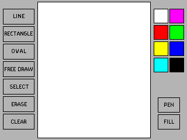

# paint-gui
그림판입니다.

</img>

## 기능

### 그리기

8 가지 색상의 다양한 도형을 그릴 수 있습니다.

- 선: 두 점을 잇는 선.
- 직사각형: 두 점을 맞꼭지점으로 하는 네모.
- 타원: 두 점을 맞꼭지점으로 하는 네모에 접하는 타원.
- 자유 그리기: 입력되는 점으로 이루어진 임의의 도형.

선과 직사각형은 rubber-band를 지원합니다.

자유 그리기는 점을 smooth하게 연결합니다.

직사각형과 타원은 윤곽선만 그릴 수 있고 속을 채울 수도 있습니다.

### 선택

그려진 객체를 선택하여 이동합니다. 여러 도형이 겹쳐있을 경우 가장 위에 있는 도형이 선택됩니다.

### 지우기

지우개가 닿은 도형은 그림판에서 사라집니다.

여러 도형이 겹쳐있을 경우, '선택'과 같이 가장 위에 있는 도형이 지워집니다.

## 문서

[설계 문서(초기)](./documents/paint-gui-class-diagram.mdj)

## 기타

이 프로그램은 임베디드시스템 강의 기말 과제를 수행하기 위해 제작되었습니다.

사용한 하드웨어는 Odroid-C1과  [3.2inch TFT+Touchscreen Shield](https://www.hardkernel.com/ko/shop/c1-3-2inch-tfttouchscreen-shield/) 입니다.

